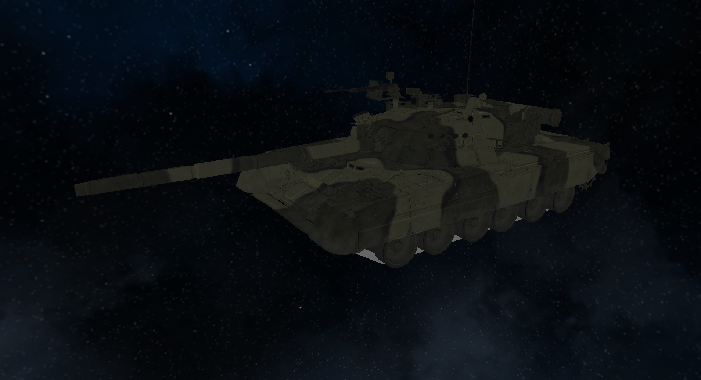
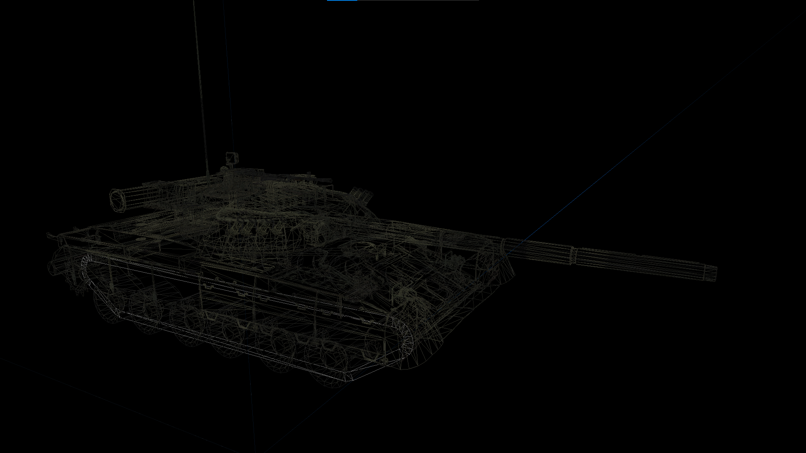
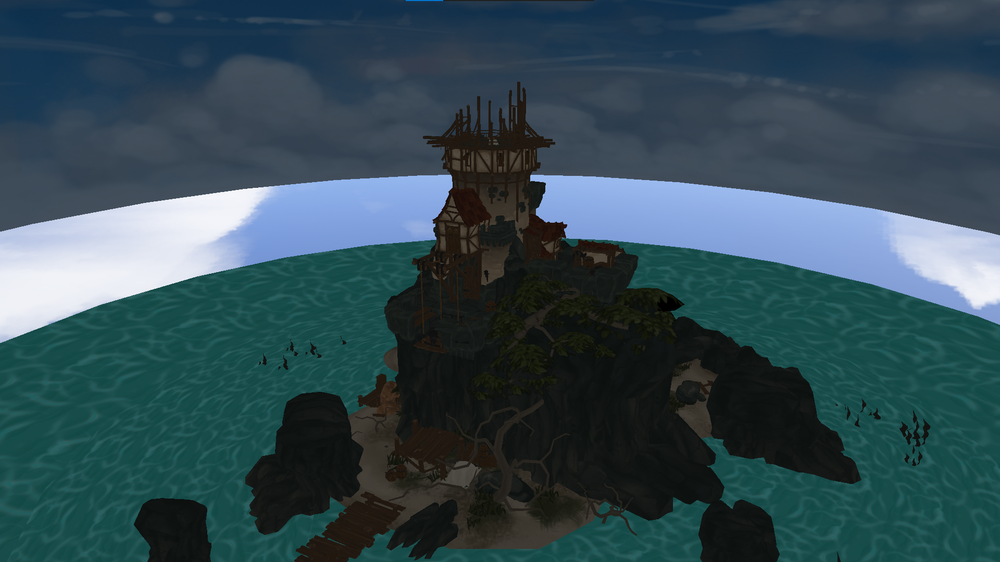
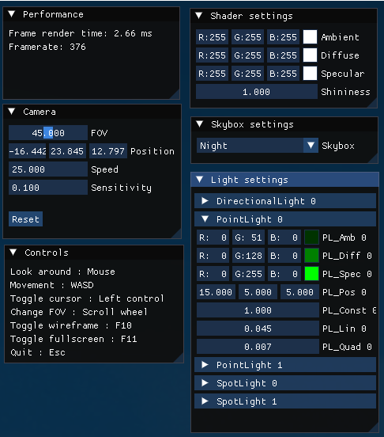

# VectorGL
A 3D forward renderer powered by C++/OpenGL. This is not meant for serious use and was simply made as a learning experience.

## Features

 - Low level OpenGL calls are abstracted into various classes
 - Texture loading
 - Cubemaps and skyboxes
 - Model and mesh loading using Assimp
 - Compile and use multiple shaders
 - Support for multiple lights: point lights, spot lights, directional lights
 - Basic renderer for batch rendering by shader and lighting
 - LightManager class is associated to a renderer to handle all the lights and send them to the shaders
 - Global Phong shader for models & meshes
 - Camera system to move around
 - Interfaces to dynamically interact with the lights, skybox, and shader settings

## Setup
 - Clone the repository `https://github.com/razor7877/VectorGL.git`
 - Download the dependencies `git submodule update --init --recursive`
 - The project can then be built using the included CMake.
 
It works on Windows (Visual Studio/MSVC) and should probably work on Linux and MacOS as well as there is no platform dependent code.

### Dependencies

 - Assimp: Model & mesh loading from various file formats
 - GLFW: Windowing, inputs and OpenGL context management
 - glad: OpenGL functions loading
 - GLM: Matrix maths
 - ImGui: Interfaces

## Pictures

