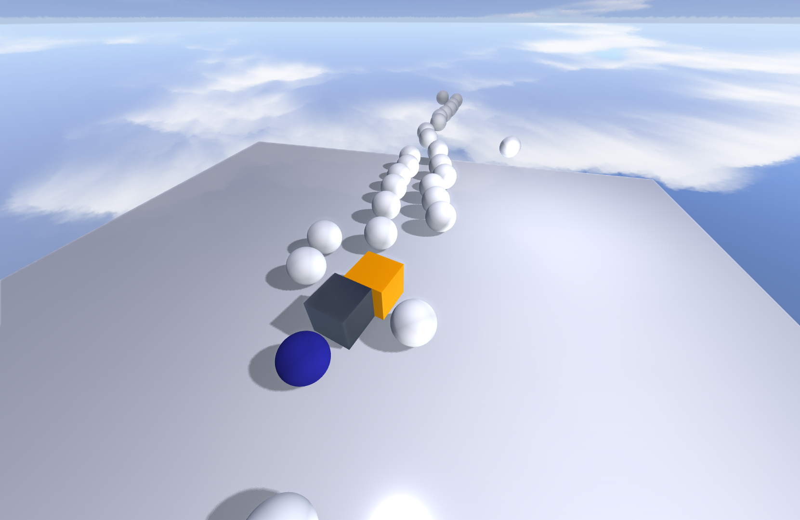

# VectorGL
A graphics engine & WIP game engine powered by C++/OpenGL. This is not meant for serious use and is simply being developed for fun.

## Features

- Full fledged PBR renderer with most common properties supported (albedo, metallic, roughness, ambient occlusion, emissive, opacity)
- Scene graph system with non-ECS component system
- Model & mesh loading of most common file formats using Assimp
- Skyboxes and image based lighting (IBL)
- Support for point lights, directional lights and spot lights
- Directional light shadow mapping
- Screen space ambient occlusion (SSAO)
- All sorts of helper classes for managing shaders, textures, creating basic geometry (quads, cubes, spheres), optimizing meshes, calculating normals, bounding boxes etc.
- Bullet engine integration for game physics
- Extremely basic Lua integration to add scripts to entities
- Complete ImGui interface to interact with every aspect of the engine, including dynamic shader recompilation and script editing
- CPU frustum culling
- Game state management

## To be added

- Skeletal animation
- Order independent transparency
- Point shadows & cascaded shadow mapping
- Bloom
- Basic UI system for making menus
- Serialization of scenes
- Iridescence & clear coat PBR support

## Setup
 - Clone the repository `https://github.com/razor7877/VectorGL.git`
 - Download the dependencies `git submodule update --init --recursive`
 - The project can then be built using the included CMake.
 
It works on Windows (Visual Studio/MSVC) and should probably work on Linux and MacOS as well as there is no platform dependent code.

### Dependencies

 - Assimp: Model & mesh loading from various file formats
 - Bullet: Physics engine
 - GLFW: Windowing, inputs and OpenGL context management
 - glad: OpenGL functions loading
 - GLM: Matrix maths
 - ImGui: Interfaces
 - Lua: Scripting support

## Pictures

